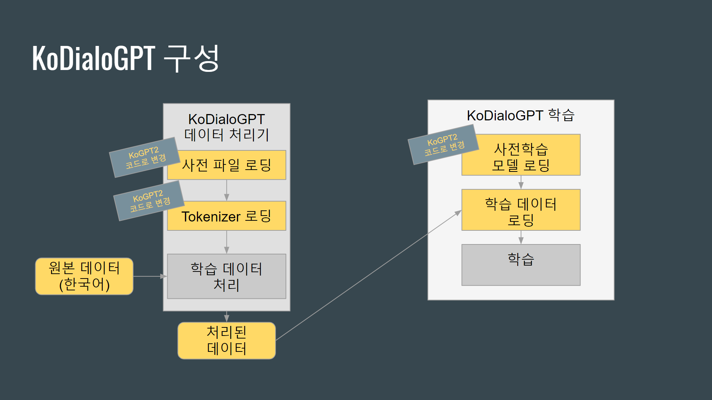
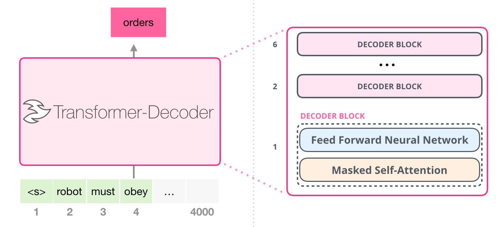

## Note
(2020/04/23) 감정 입력은 아직 반영 안 된 기본 대화 시스템입니다.

## System/SW Overview
* 개발 목표
감정과 대화를 입력으로 받아서 대화 히스토리에 대해 적절한 답변을 할 수 있는 시스템 개발

* 최종 결과물
감정과 대화를 입력으로 받아서 답변을 생성합니다.

* 시스템/SW 대표 그림


## How to Install
1. Clone DialoGPT  
```bash
git clone http://EmoCA.kaist.ac.kr/calee/DialoGPT.git
```

2. Install Docker

3. Prepare vocab, and normal and reverse models  
* Contact calee@aibrain.co.kr to get files

4. Set paths from config.py file  
* The paths should be relative to DialoGPT directory

5. Change directory to DialoGPT/docker

6. Run run.sh
```bash
bash run.sh
```

## Main requirement
* Docker

## Network Architecture and features

* **Model:**
* The model is able to do language modeling.
* **Masked Self-Attention:**
* Masks future tokens.
* Refer http://jalammar.github.io/illustrated-gpt2/ for more details about the model.
* **Metrics:**
* Perplexity

## Quick start
* See How to Install to install
* Use any http client to get a response  
ex)  
```bash
wget "localhost:5000/?utext=%EB%82%98%EB%8A%94%20%EC%95%BC%EA%B5%AC%EB%A5%BC%20%EC%A2%8B%EC%95%84%ED%95%B4.&emotion=10001&uid=1"
```
* Response  
> ```
> {"text": "야구를 정말 좋아하는 사람은 나야.", "emotion": 10005}
> ```

## Training Data
* Opensubtitles v2018 ko
  - 총 3,324개의 대화 (영화)
  - 총 1,048,575개의 턴
  - 64MB
  - 감정: 감정 분류기로 태깅
* 아크릴 텍스트 대화 데이터
  - 총 26,200개의 대화
  - 총 152, 896개의 턴
  - 12MB
  - 감정: 대화 작성자가 태깅

## Training Model (Fine-tuning the provided trained model)
### How to Install
1. Install Anaconda  
```bash
cd ~
mkdir Downloads
cd ~/Downloads
wget https://repo.anaconda.com/archive/Anaconda3-2020.02-Linux-x86_64.sh
bash Anaconda3-2020.02-Linux-x86_64.sh
```
Follow instructions.  
Answer 'yes' to prepend the Anaconda3 install location to PATH in your .bashrc.  
Answer 'no' not to install Microsoft VSCode.


2. Install NVIDIA CUDA Toolkit  


3. Clone DialoGPT  
```bash
git clone http://EmoCA.kaist.ac.kr/calee/DialoGPT.git
```


4. Create and activate conda environment  
```bash
cd DialoGPT
conda env create -f LSP-linux.yml -n LSP
conda activate LSP
```

5. Clone and install KoGPT2  
```bash
git clone http://EmoCA.kaist.ac.kr/calee/KoGPT2.git
cd KoGPT2
pip install -r requirements.txt
pip install .
```


6. Copy files  
data/train.200len.db  
data/valid.200len.db  

7. Train
```bash
bash run.sh
```

### Main requirement
You may be able to use the library without this requirements, but the library is tested only from the below environment.
- One or more Titan V or GeForce GTX 1080 Ti graphics cards (driver should be installed)
- Ubuntu 18.04.4 LTS or CentOS 7

### Speed Up
To speed up, install apex, and change the option fp16 to true and gradient_accumulation_steps to 8 on run.sh.

## Test
```bash
python interact.py {vocab_path} {model_path} {reverse_model_path}
```

## HTTP-server API description
* Path: /
* Port: 5000
* Method: get
|Parameter|Type|Description|
|---|---|---|
|utext|string|Input text|
|emotion|integer|Input emotion (Happiness: 10001, Anger: 10002, Disgust: 10003, Fear: 10004, Neutral: 10005, Sadness: 10006, Surprise: 10007)|
|uid|string|ID of the dialogue context (any unique string for each dialogue)|
* Response
```
{"text": "야구를 정말 좋아하는 사람은 나야.", "emotion": 10005}
```

## Repository overview
* configs/ - Configurations for each models
* data/ - Data preparation
* data/dummy_data.tsv - Dummy data
* data/filter_bland.py - Filters bland data
* data/prepare4db.sh - Change tsv files to db format
* data/to_tsv.py - Change xlsx files to tsv format
* data/train_raw.tsv - An example tsv file.
* docker/ - Docker related files
* gpt2_training/eval_utils.py - Validation code
* gpt2_training/train_utils.py - Training code
* img/ - Image directory for README.md
* lsp_model/modeling_gpt2.py - Model code
* lsp_model/optim.py - Optimizer code
* reddit_extractor/ - Reddit data preparation
* bot.py - Code for easier test.
* LSP_train.py - Main training code
* LSP_valid.py - Main validation code
* config.py - Configuration file
* data_loader.py - Loader from db
* demo.py - Demo script
* discord_bot.py - Discord bot
* interact.py - Test script
* prepro.py - Change a tsv file to db format
* run.sh - Training script
* run_eval.sh - Evaluation script
* run_sample.sh - Test script to test for a few sentences
* sample.py - Test code to test for a few sentences
